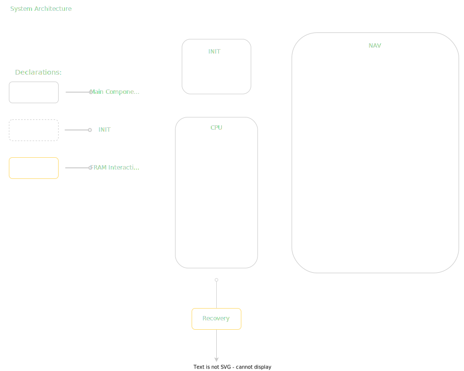

# COMPASS

> **C**ontrol, **O**rient, **M**anoeuvre, **P**ath **A**lign and **S**tabilise **S**paceflight

Welcome to the documentation for project COMPASS, whose objective it is to prepare for rocket 
launch in spring 2024. Specifically, the goal of this project is the following:

- Integrate and develop testing for Kamlan Filter
- Integrate projcet with FRAM data bus
- Have a recovery system for SD-Card data in case of system failure
- Record/calculate apogee of rocket, and set recovery flag for Recovery Project
... among others

Further details about each goal is or will be documentated further, as well as visualization of how the 
project is strung together. Additionally we have in-depth instructions on how we structure and write our code. 

For further questions, contact Brage, Felix or Håkon.

## Project layout

~~~ cpp
?
~~~ 

## System architecture

